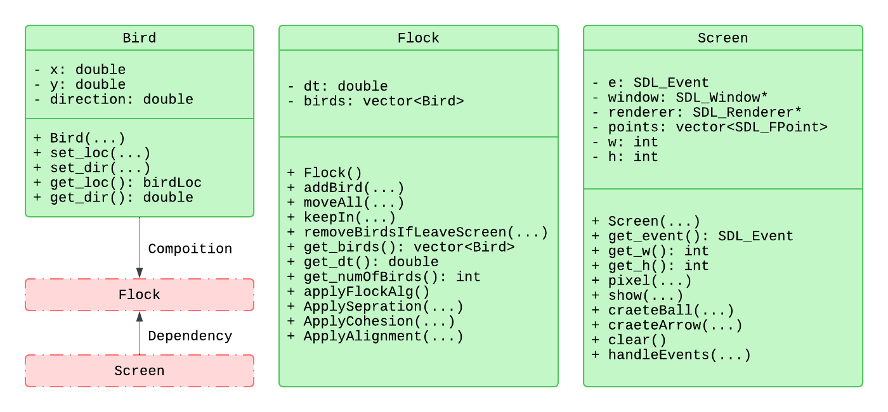
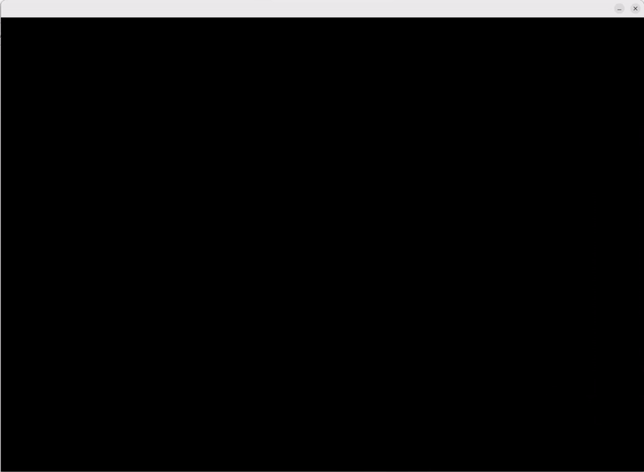

# Flock Simulation Project

## Overview
This project simulates flocking behavior using **C++** and **SDL2**. The simulation consists of three main classes:

- **Bird**: Represents an individual bird in the flock.
- **Flock**: Manages a group of birds and applies the flocking algorithm.
- **Screen**: Handles the SDL2 window and rendering for the simulation.

### UML Diagram
Below is a UML diagram illustrating the relationship between the classes:



- **Bird Class**:  
  - Attributes: `x`, `y` (position) and `direction`.  
  - Methods: Functions to set and get location and direction.  
  - Used in the `Flock` class through composition.

- **Flock Class**:  
  - Attributes: `birds` (a vector of `Bird` objects) and `dt` (time step).  
  - Manages bird movement and applies flocking behaviors like separation, cohesion, and alignment.

- **Screen Class**:  
  - Attributes: `window`, `renderer`, `points`, `width (w)`, and `height (h)`.  
  - Manages rendering of the birds and handles events like quitting the simulation.

---

## How to Clone and Build the Project

### Step 1: Clone the Repository
To clone the repository, use the following command in your terminal or command prompt:

```bash
git clone git@github.com:SmFaraji/Flocking_cpp.git
cd Flocking_cpp
```
### Step 2: Install SDL2
Ensure SDL2 is installed on your system. You can install it using your package manager or download it from the SDL2 official website.

- **Ubuntu/Debian:**:
```bash
sudo apt-get install libsdl2-dev
```

- **Windows**:
Download SDL2 and extract it into your project directory (or set up your environment to find SDL2).

- **MacOS**:
```bash
brew install sdl2
```

### Step 3: Build the Project Using CMake
Create a build directory and navigate into it. Run CMake to generate the build files and build the project.
```bash
mkdir build
cd build
cmake ..
cmake --build .
```

### Step 4: Run the Executable
```bash
./flock
```
### Visual Demonstration
You can add new birds to the simulation by clicking anywhere on the screen with a left mouse click.  
Newly added birds will follow the flocking rules and behave like the rest of the flock.



## Contact
- 🔗 **LinkedIn**: [Mohammad Faraji](https://www.linkedin.com/in/smfaraji)  
- 💻 **GitHub**: [SmFaraji](https://github.com/SmFaraji) 
- ▶️ **YouTube Channel**: [@sm_faraji](https://www.youtube.com/@sm_faraji)  
- 📢 **Telegram Channel**: [EngineeringLab](https://t.me/EngineeringLab) 
- ✍️ **Medium**: [@sm_faraji](https://medium.com/@sm_faraji)   
- 📺 **Aparat Channel**: [EngineeringLab](https://www.aparat.com/EngineeringLab)  

